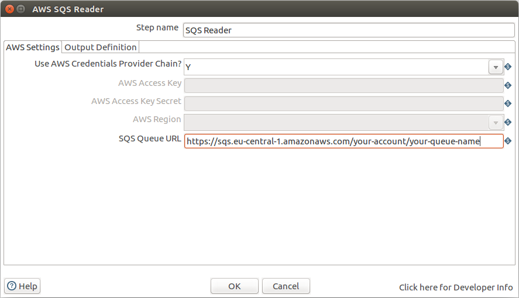
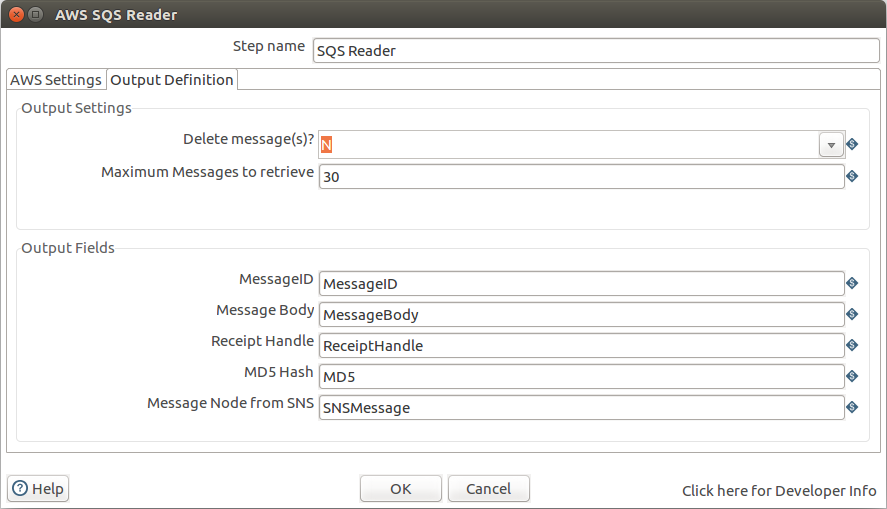

# Usage

## Preconditions

Before the first execution you need to create an IAM-Role (e.g. for usage on EC2/ECS) or an IAM-User with an AWS Key and Secret and attach the required policies for pushing notifications via SNS.  
You also need to create one ore more subscription topics you want to push the messages to.

## Settings

On the Settings Tab you need to define your AWS Credentials. You can choose either to have the plugin search these credentials via the [AWS Credentials Chain][aws-chain] or provide the following:

- your AWS Access Key,
- the Secret for your AWS Access Key and
- the AWS-Region the service is running in.

You further have to enter the URL of the SQS Queue (starting with https:// - not the ARN!)

## Output Definitions

On the Notifications Tab you can define the output fields for the informations read from the SQS message as well as some initial settings for receiving the messages.

### Output Settings

- Delete Message(s): shall the message(s) be deleted fromt the queue after receiving?
- Maximum Message to retrieve: Step will finish after reaching the maximum. Zero (0) will receive all messages in the queue.

### Output-Fields

- MessageID: For each message an unique ID is retrieved from SQS. This can be written to an output field defined here.
- MessageBody: Complete content of the message.
- ReceiptHandle: Unique identifier for receiving a message.
- MD5 Hash: MD5 hash of the message body
- Message Node from SNS: if the message was sent from SNS this field will contain the content of the JSON node "Message" within the Message body.

### 

[aws-chain]: https://docs.aws.amazon.com/sdk-for-java/v1/developer-guide/credentials.html